# Diagram Architektury UI - GymRatPlanner

## Analiza Architektury

### Komponenty Zidentyfikowane w Kodzie

#### Layouts:
- **BaseLayout.astro** - Główny layout aplikacji z nawigacją, headerem i footerem
- **AuthLayout.astro** - Dedykowany layout dla stron autentykacji

#### Strony Publiczne:
- **index.astro** - Landing page z automatycznym przekierowaniem dla zalogowanych użytkowników
- **login.astro** - Strona logowania
- **signup.astro** - Strona rejestracji

#### Strony Chronione:
- **templates.astro** - Lista szablonów treningowych użytkownika
- **templates/new.astro** - Tworzenie nowego szablonu
- **templates/[id].astro** - Szczegóły konkretnego szablonu
- **workouts.astro** - Historia wykonanych treningów
- **workout/[templateId].astro** - Aktywny trening oparty na szablonie

#### Komponenty React - Autentykacja:
- **LoginForm.tsx** - Formularz logowania z walidacją email/hasło
- **SignUpForm.tsx** - Formularz rejestracji z potwierdzeniem hasła

#### Komponenty React - Nawigacja:
- **NavigationHeader.astro** - Główna nawigacja z linkami i przyciskiem wylogowania

#### Komponenty React - Szablony:
- **TemplatesList.tsx** - Lista wszystkich szablonów użytkownika
- **CreateTemplateForm.tsx** - Kompleksowy formularz tworzenia szablonu
- **TemplateCard.tsx** - Karta pojedynczego szablonu
- **TemplateDetails.tsx** - Widok szczegółów szablonu
- **ExerciseSelector.tsx** - Komponent wyboru ćwiczeń z biblioteki
- **ExerciseList.tsx** - Lista ćwiczeń w szablonie
- **ExerciseItem.tsx** - Pojedyncze ćwiczenie z konfiguracją
- **TemplateNameInput.tsx** - Input nazwy szablonu
- **FormActions.tsx** - Przyciski akcji formularza

#### Komponenty React - Treningi:
- **WorkoutsList.tsx** - Historia wykonanych treningów
- **WorkoutForm.tsx** - Główny formularz logowania treningu
- **ExerciseInput.tsx** - Input dla ćwiczenia podczas treningu
- **SetInputRow.tsx** - Wiersz z inputami dla pojedynczej serii
- **StickyHeader.tsx** - Sticky header z informacjami o treningu
- **StickyFooterActions.tsx** - Sticky footer z akcjami (zakończ/anuluj)
- **LoadingOverlay.tsx** - Overlay podczas ładowania
- **SuccessToast.tsx** - Powiadomienie o sukcesie

#### Komponenty Współdzielone:
- **ConfirmDialog.tsx** - Dialog potwierdzenia dla destrukcyjnych akcji
- **shadcn/ui components** - Button, Input, Label, Card, Dialog, Popover, Command

### Przepływ Danych

#### Autentykacja:
1. Użytkownik wchodzi na landing → sprawdzenie sesji → przekierowanie lub wyświetlenie
2. Formularz logowania/rejestracji → API endpoint → ustawienie cookies → przekierowanie
3. Każda chroniona strona → walidacja sesji → dostęp lub przekierowanie do logowania
4. Wylogowanie → API endpoint → usunięcie cookies → przekierowanie

#### Zarządzanie Szablonami:
1. Lista szablonów → API fetch → wyświetlenie kart
2. Tworzenie szablonu → wybór ćwiczeń → konfiguracja → API POST → przekierowanie
3. Szczegóły szablonu → API fetch → wyświetlenie → opcje akcji

#### Logowanie Treningów:
1. Start treningu → pobranie danych prefill → wyświetlenie formularza
2. Edycja wartości → walidacja → zapisanie → aktualizacja PB → przekierowanie

### Zarządzanie Stanem

- **Supabase Auth** - Sesje użytkownika (JWT w cookies)
- **React useState** - Lokalny stan komponentów (loading, errors, form data)
- **Server-side validation** - Walidacja sesji w każdej chronionej stronie Astro
- **Toast notifications** - Feedback użytkownika (sonner)
- **API endpoints** - Komunikacja z backendem i bazą danych

---

## Diagram Mermaid

```mermaid
flowchart TD
    subgraph "Layouts"
        BL["BaseLayout"]
        AL["AuthLayout"]
    end

    subgraph "Strony Publiczne"
        LP["Landing Page"]
        LOGIN["Login Page"]
        SIGNUP["Signup Page"]
    end

    subgraph "Strony Chronione"
        TMPL["Templates Page"]
        TMPL_NEW["Create Template Page"]
        TMPL_DET["Template Details Page"]
        WRK["Workouts Page"]
        WRK_ACT["Active Workout Page"]
    end

    subgraph "Komponenty Auth"
        LF["LoginForm"]
        SF["SignUpForm"]
    end

    subgraph "Komponenty Nawigacji"
        NH["NavigationHeader"]
    end

    subgraph "Komponenty Szablonów"
        TL["TemplatesList"]
        CTF["CreateTemplateForm"]
        TC["TemplateCard"]
        TD["TemplateDetails"]
        ES["ExerciseSelector"]
        EL["ExerciseList"]
        EI["ExerciseItem"]
        TNI["TemplateNameInput"]
        FA["FormActions"]
    end

    subgraph "Komponenty Treningów"
        WL["WorkoutsList"]
        WF["WorkoutForm"]
        EIN["ExerciseInput"]
        SIR["SetInputRow"]
        SH["StickyHeader"]
        SFA["StickyFooterActions"]
        LO["LoadingOverlay"]
        ST["SuccessToast"]
    end

    subgraph "Komponenty Współdzielone"
        CD["ConfirmDialog"]
        UI["shadcn/ui Components"]
    end

    subgraph "API Endpoints"
        API_LOGIN["POST /api/auth/login"]
        API_SIGNUP["POST /api/auth/signup"]
        API_LOGOUT["POST /api/auth/logout"]
        API_TMPL["GET/POST /api/templates"]
        API_TMPL_ID["GET/DELETE /api/templates/:id"]
        API_WRK["GET/POST /api/workouts"]
        API_PREFILL["GET prefill data"]
    end

    subgraph "Zarządzanie Sesją"
        COOKIES["Cookies: sb-access-token, sb-refresh-token"]
        SUPABASE["Supabase Auth"]
        SESSION["Session Validation"]
    end

    LP -->|używa| BL
    LP -->|sprawdza sesję| SESSION
    LP -->|przekierowuje jeśli zalogowany| TMPL
    LP -->|wyświetla dla niezalogowanych| LP

    LOGIN -->|używa| AL
    LOGIN -->|renderuje| LF
    LF -->|POST| API_LOGIN
    API_LOGIN -->|ustawia| COOKIES
    COOKIES -->|przechowuje| SUPABASE
    API_LOGIN -->|sukces| TMPL

    SIGNUP -->|używa| AL
    SIGNUP -->|renderuje| SF
    SF -->|POST| API_SIGNUP
    API_SIGNUP -->|ustawia| COOKIES
    API_SIGNUP -->|sukces| TMPL

    TMPL -->|używa| BL
    TMPL -->|waliduje| SESSION
    TMPL -->|renderuje| NH
    TMPL -->|renderuje| TL
    TL -->|pobiera dane| API_TMPL
    TL -->|wyświetla| TC
    TC -->|używa| UI

    TMPL_NEW -->|używa| BL
    TMPL_NEW -->|waliduje| SESSION
    TMPL_NEW -->|renderuje| CTF
    CTF -->|zawiera| ES
    CTF -->|zawiera| EL
    CTF -->|zawiera| TNI
    CTF -->|zawiera| FA
    EL -->|wyświetla| EI
    CTF -->|POST| API_TMPL
    CTF -->|używa| UI

    TMPL_DET -->|używa| BL
    TMPL_DET -->|waliduje| SESSION
    TMPL_DET -->|renderuje| TD
    TD -->|pobiera dane| API_TMPL_ID
    TD -->|wyświetla| EL
    TD -->|używa| CD
    TD -->|DELETE| API_TMPL_ID

    WRK -->|używa| BL
    WRK -->|waliduje| SESSION
    WRK -->|renderuje| NH
    WRK -->|renderuje| WL
    WL -->|pobiera dane| API_WRK
    WL -->|używa| UI

    WRK_ACT -->|używa| BL
    WRK_ACT -->|waliduje| SESSION
    WRK_ACT -->|renderuje| WF
    WF -->|pobiera| API_PREFILL
    WF -->|zawiera| SH
    WF -->|zawiera| EIN
    WF -->|zawiera| SFA
    EIN -->|wyświetla| SIR
    WF -->|pokazuje| LO
    WF -->|POST| API_WRK
    WF -->|pokazuje| ST
    WF -->|używa| CD
    WF -->|używa| UI

    NH -->|przycisk wylogowania| API_LOGOUT
    API_LOGOUT -->|usuwa| COOKIES
    API_LOGOUT -->|przekierowuje| LOGIN

    SESSION -->|sprawdza| COOKIES
    SESSION -->|waliduje przez| SUPABASE
    SESSION -->|brak sesji| LOGIN

    classDef publicPage fill:#e1f5ff,stroke:#0288d1,stroke-width:2px
    classDef protectedPage fill:#fff3e0,stroke:#f57c00,stroke-width:2px
    classDef authComponent fill:#f3e5f5,stroke:#7b1fa2,stroke-width:2px
    classDef templateComponent fill:#e8f5e9,stroke:#388e3c,stroke-width:2px
    classDef workoutComponent fill:#fff9c4,stroke:#f9a825,stroke-width:2px
    classDef sharedComponent fill:#fce4ec,stroke:#c2185b,stroke-width:2px
    classDef apiEndpoint fill:#e0f2f1,stroke:#00796b,stroke-width:2px
    classDef sessionMgmt fill:#ffebee,stroke:#c62828,stroke-width:2px
    classDef layout fill:#f5f5f5,stroke:#616161,stroke-width:2px

    class LP,LOGIN,SIGNUP publicPage
    class TMPL,TMPL_NEW,TMPL_DET,WRK,WRK_ACT protectedPage
    class LF,SF authComponent
    class TL,CTF,TC,TD,ES,EL,EI,TNI,FA templateComponent
    class WL,WF,EIN,SIR,SH,SFA,LO,ST workoutComponent
    class CD,UI,NH sharedComponent
    class API_LOGIN,API_SIGNUP,API_LOGOUT,API_TMPL,API_TMPL_ID,API_WRK,API_PREFILL apiEndpoint
    class COOKIES,SUPABASE,SESSION sessionMgmt
    class BL,AL layout
```



## Legenda

- **Niebieski** - Strony publiczne (dostępne bez logowania)
- **Pomarańczowy** - Strony chronione (wymagają autentykacji)
- **Fioletowy** - Komponenty autentykacji
- **Zielony** - Komponenty zarządzania szablonami
- **Żółty** - Komponenty logowania treningów
- **Różowy** - Komponenty współdzielone
- **Turkusowy** - Endpointy API
- **Czerwony** - Zarządzanie sesją
- **Szary** - Layouts

## Kluczowe Przepływy

### 1. Przepływ Rejestracji i Logowania
```
Użytkownik → Landing Page → Sprawdzenie sesji
  ↓ (brak sesji)
Login/Signup Page → Formularz → API endpoint → Cookies → Przekierowanie do Templates
```

### 2. Przepływ Tworzenia Szablonu
```
Templates Page → Create Template → ExerciseSelector → Konfiguracja
  ↓
CreateTemplateForm → POST /api/templates → Przekierowanie do Templates
```

### 3. Przepływ Logowania Treningu
```
Templates → Start Workout → Pobierz prefill → WorkoutForm
  ↓
Edycja wartości → Walidacja → POST /api/workouts → Aktualizacja PB → Sukces
```

### 4. Przepływ Wylogowania
```
NavigationHeader → Przycisk Logout → POST /api/auth/logout
  ↓
Usunięcie cookies → Przekierowanie do Login
```

## Notatki Implementacyjne

1. **Walidacja Sesji**: Każda chroniona strona Astro sprawdza cookies sesji przed renderowaniem
2. **Prefill Danych**: Workout Form automatycznie wypełnia dane z ostatniego treningu
3. **Zarządzanie Stanem**: React useState dla lokalnego stanu, Supabase Auth dla sesji
4. **Responsywność**: Wszystkie komponenty zoptymalizowane dla desktop i mobile
5. **Feedback Użytkownika**: Toast notifications (sonner) dla wszystkich akcji
6. **Dialogi Potwierdzenia**: Używane dla destrukcyjnych akcji (usuwanie, anulowanie)
